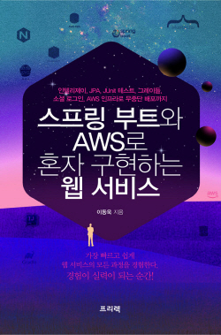

# 스프링 부트와 AWS로 혼자 구현하는 웹 서비스
> 스프링 부트와 AWS로 혼자 구현하는 웹 서비스 따라하기

## 주요 목표

1. 게시판 구현

2. OAuth 2.0을 활용한 로그인 기능 구현 (Google Api | Naver Api)

3. AWS EC2, RDS 연동

4. AWS EC2 무중단 서비스 배포

## 개발 환경

Back-end

* SpringBoot ~~2.1.9~~ 2.4.*
* Gradle ~~4.10.2~~ 6.8.*
* Junit ~~4~~ 5
* H2
  
Front-end

* Bootstrap
* jQuery
* Mustache

## 이슈

1. p.297 

- AWS EC2에서 프로젝트 테스트(./gradlew test) 오류

- Spring Boot 2.1 -> 2.4 버전 변경
  

- Gradle 4 -> 6 버전 변경
  

- Junit 4 -> 5 버전 변경
  

- [(2020.12.16)스프링 부트와 AWS로 혼자 구현하는 웹 서비스 최신 코드로 변경하기](https://jojoldu.tistory.com/539?category=717427) 참조